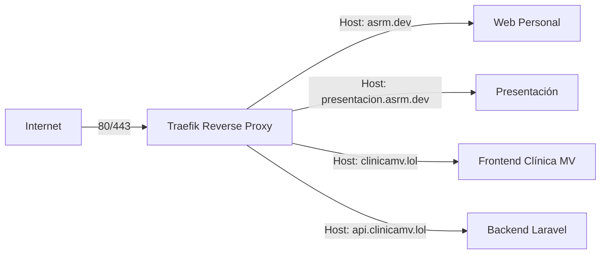

# Reverse proxy con Traefik (Docker)

Reverse Proxy con Traefik (Docker)
## Introducción

Este servicio actúa como **proxy inverso central** para todos los sitios y aplicaciones desplegados en el servidor.
Su función principal es **gestionar el enrutamiento, certificados SSL/TLS y la comunicación segura** entre los distintos servicios (webs, APIs y aplicaciones internas) utilizando **Traefik v3**.

El sistema está diseñado para alojar varios proyectos en el mismo servidor, cada uno en su propio stack Docker, pero compartiendo un proxy común.
Actualmente se utilizan los siguientes dominios:
|Proyecto|Dominio principal|Descripción|
|--------|--------|--------|
Web personal|``asrm.dev``|Sitio personal de Sebastián Rodríguez
Presentación del proyecto|``presentacion.asrm.dev``|Web de presentación del proyecto final
Clínica Dietética MV (frontend)|``clinicamv.lol``|Aplicación Angular de la clínica
API de Clínica Dietética MV|``api.clinicamv.lol``|Backend Laravel con autenticación y API REST

---

## Arquitectura general

Traefik se ejecuta como un servicio Docker independiente y expone los puertos **80 (HTTP) y 443 (HTTPS)**.
Los demás contenedores se comunican con él a través de una red externa compartida llamada ``traefik-proxy``.

---
## Diagrama de flujo


## Funcionalidades principales

- Redirección automática de HTTP → HTTPS.

- Emisión y renovación automática de certificados SSL (Let’s Encrypt).

- Enrutamiento por **Host** y *PathPrefix* mediante *labels* de Docker.

- Configuración declarativa: sin necesidad de editar archivos internos de Traefik.

- Soporte para múltiples *stacks* y despliegues independientes.

## Requisitos previos

**Docker y Docker Compose** instalados en el servidor.

Todos los dominios deben apuntar a la IP pública del servidor mediante registros DNS tipo **A** o **CNAME**.

Los puertos **80** y **443** deben estar abiertos en el firewall.

Crear la red externa compartida antes del primer despliegue:

> docker network create traefik-proxy

---

## Estructura del servicio Traefik

```yaml
/traefik/
├── docker-compose.yml
└── letsencrypt/
    └── acme.json
```

> [!NOTE]
> El archivo ``acme.json`` se utiliza para almacenar los certificados SSL emitidos por Let's Encrypt.

---
## Configuración del contenedor Traefik
Ejemplo de docker-compose.yml básico:

```yaml
version: "3.8"

services:
  traefik:
    image: traefik:v3.1
    container_name: traefik
    restart: always
    ports:
      - "80:80"
      - "443:443"
    networks:
      - traefik-proxy
    volumes:
      - /var/run/docker.sock:/var/run/docker.sock:ro
      - ./letsencrypt:/letsencrypt
    command:
      # Proveedor Docker
      - "--providers.docker=true"
      - "--providers.docker.exposedbydefault=false"

      # Entradas
      - "--entrypoints.web.address=:80"
      - "--entrypoints.websecure.address=:443"

      # Redirección HTTP → HTTPS
      - "--entrypoints.web.http.redirections.entrypoint.to=websecure"
      - "--entrypoints.web.http.redirections.entrypoint.scheme=https"

      # Certificados Let's Encrypt
      - "--certificatesresolvers.le.acme.email=sebastian@asrm.dev"
      - "--certificatesresolvers.le.acme.storage=/letsencrypt/acme.json"
      - "--certificatesresolvers.le.acme.httpchallenge=true"
      - "--certificatesresolvers.le.acme.httpchallenge.entrypoint=web"

      # Logs
      - "--log.level=INFO"
      - "--accesslog=true"

networks:
  traefik-proxy:
    external: true
```
---
### Inicialización del volumen de certificados
```bash
mkdir -p traefik/letsencrypt
touch traefik/letsencrypt/acme.json
chmod 600 traefik/letsencrypt/acme.json
```
---
## Conexión de servicios a Traefik

Cada aplicación (API, frontend o sitio web) se declara en su propio stack de Docker Compose.
Para que Traefik las detecte, deben cumplir dos condiciones:

1. Estar conectadas a la red traefik-proxy.

2. Tener labels de Traefik configuradas para definir el enrutamiento.

### Ejemplo 1: Web personal (asrm.dev)
```yaml
services:
  asrm-web:
    image: ghcr.io/sebasrodmag/asrm-web:latest
    networks: [traefik-proxy]
    labels:
      - "traefik.enable=true"
      - "traefik.http.routers.asrm.rule=Host(`asrm.dev`)"
      - "traefik.http.routers.asrm.entrypoints=websecure"
      - "traefik.http.routers.asrm.tls.certresolver=le"
      - "traefik.http.services.asrm.loadbalancer.server.port=80"
```

### Ejemplo 2: Web de presentación (presentacion.asrm.dev)
```yaml
services:
  presentacion-web:
    image: ghcr.io/sebasrodmag/presentacion-asrm:latest
    networks: [traefik-proxy]
    labels:
      - "traefik.enable=true"
      - "traefik.http.routers.presentacion.rule=Host(`presentacion.asrm.dev`)"
      - "traefik.http.routers.presentacion.entrypoints=websecure"
      - "traefik.http.routers.presentacion.tls.certresolver=le"
      - "traefik.http.services.presentacion.loadbalancer.server.port=80"
```

### Ejemplo 3: Clínica Dietética MV – Frontend (clinicamv.lol)
```yaml
services:
  clinicamv-frontend:
    image: ghcr.io/sebasrodmag/clinicamv-frontend:main
    networks: [traefik-proxy]
    labels:
      - "traefik.enable=true"
      - "traefik.http.routers.clinica-fe.rule=Host(`clinicamv.lol`)"
      - "traefik.http.routers.clinica-fe.entrypoints=websecure"
      - "traefik.http.routers.clinica-fe.tls.certresolver=le"
      - "traefik.http.services.clinica-fe.loadbalancer.server.port=80"
```

### Ejemplo 4: API Laravel (api.clinicamv.lol)
```yaml
services:
  clinicamv-api:
    image: ghcr.io/sebasrodmag/clinicamv-api:latest
    networks: [traefik-proxy]
    environment:
      - APP_ENV=production
      - TRUSTED_PROXIES=*
    labels:
      - "traefik.enable=true"
      - "traefik.http.routers.clinica-api.rule=Host(`api.clinicamv.lol`)"
      - "traefik.http.routers.clinica-api.entrypoints=websecure"
      - "traefik.http.routers.clinica-api.tls.certresolver=le"
      - "traefik.http.services.clinica-api.loadbalancer.server.port=8000"
```

>[!IMPORTANT]
>el contenedor del backend debe escuchar en ``0.0.0.0`` y no solo en ``localhost``, de lo contrario Traefik no podrá acceder al servicio.

## Middlewares recomendados

Se pueden aplicar middlewares globales para añadir seguridad y compresión:

```yaml
labels:
  - "traefik.http.middlewares.secHeaders.headers.stsSeconds=31536000"
  - "traefik.http.middlewares.secHeaders.headers.stsIncludeSubdomains=true"
  - "traefik.http.middlewares.secHeaders.headers.stsPreload=true"
  - "traefik.http.middlewares.secHeaders.headers.contentTypeNosniff=true"
  - "traefik.http.middlewares.secHeaders.headers.browserXssFilter=true"
  - "traefik.http.middlewares.secHeaders.headers.frameDeny=true"
  - "traefik.http.middlewares.gzip.compress=true"
```
Luego, pueden agregarse a cada router:
``traefik.http.routers.<nombre>.middlewares=secHeaders,gzip``

---

## Buenas prácticas
|Recomendación|Descripción|
|-------------|-----------|
|**Un solo Traefik por servidor**|Evita conflictos en los puertos 80/443.|
|**Usar** ``exposedByDefault=false``|Solo se exponen servicios que se indiquen explícitamente.|
|**TLS obligatorio**|Todos los routers deben usar ``entrypoints=websecure``.|
|**Certificados persistentes**|Asegúrate de conservar ``acme.json`` entre reinicios.|
|**Logs y accesslogs**|Mantén ``--log.level=INFO`` y ``--accesslog=true`` para depurar errores.|
|**Permisos seguros en** ``acme.json``|Solo accesible por Traefik (600).|

---
## Solución de problemas

|Error|Posible causa|Solución|
|-----|-------------|--------|
|``502 Bad Gateway``|El servicio no está en ``traefik-proxy`` o el puerto es incorrecto|Revisa ``loadbalancer.server.port`` y la red|
|Certificado no emitido|DNS o puertos incorrectos|Verifica registros DNS y firewall|
|Página no segura (HTTP)|Falta redirección|Confirma las opciones ``http.redirections.entrypoint``|
|No se carga el servicio|``traefik.enable=false`` o falta label|Añade la label ``traefik.enable=true``|
|Dominio apunta al sitio equivocado|Reglas de host superpuestas|Ajusta la expresión ``Host()`` en cada router|

---
## Comandos útiles

|Acción|Comando|
|------|-------|
|Iniciar Traefik|``docker compose -f traefik/docker-compose.yml up -d``|
|Ver logs en tiempo real|``docker logs -f traefik``|
|Probar conexión HTTP|``curl -I http://localhost``|
|Probar conexión HTTPS|``curl -I https://asrm.dev``|
|Verificar certificados|docker exec -it traefik ls /letsencrypt|
|Reconstruir Traefik|``docker compose -f traefik/docker-compose.yml up -d --force-recreate``|
---
## Checklist de despliegue

- Todos los dominios apuntan correctamente al servidor.

- Red traefik-proxy creada y compartida.

- acme.json existe y tiene permisos 600.

- Cada servicio tiene traefik.enable=true.

- Se ha ejecutado docker compose up -d en cada stack.

- Los certificados se han emitido correctamente.

- Los sitios son accesibles por HTTPS.

---
**Autor**: Sebastián Rodríguez
**Correo**: sebastian@asrm.dev
**Última** actualización: Octubre 2025